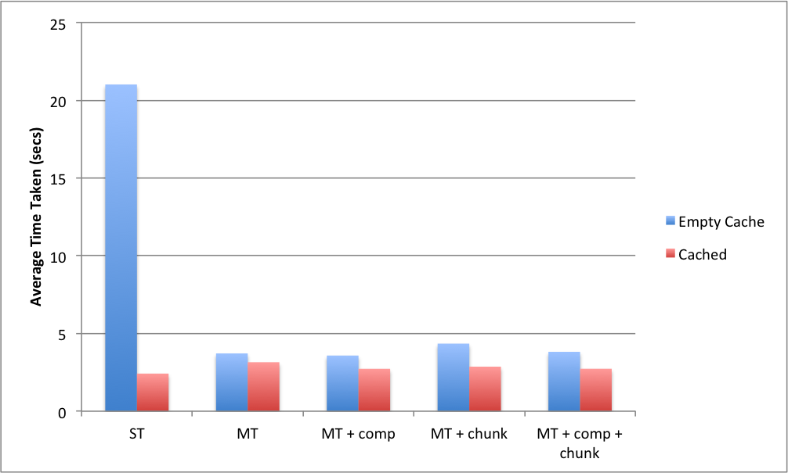

# Introduction

This program is a simple cache proxy server that logs all HTTP traffic (not HTTPS) and provides some basic options such as limiting the cache size as well as the number of concurrently running threads. It can handle gzip compressed websites as well as chunked responses. You can compile it using the `make` command or alternatively:

```
gcc -o project_4 *.c -std=c99 -lpthread
```

To run the program, execute:

```
./project_4 9001 10 20
```

This will serve the proxy server on the address: *<http://127.0.0.1:9001>*, with a maximum of 10 concurrent threads and a 20MB cache size limit.

# How it Works


As you can see in Figure 1, the structure of the cache consists of a double-linked list of `C_block`s (representing a cache block for a single page), with a pointer called `cache_start` pointing at the start of the cache and a pointer called `cache_end` pointing at the end. By using a double linked list, we can remove a cache block (say when we use the Least Recently Used algorithm) immediately without traversing the list to find the previous and next blocks. The pointer to the end of the linked list allows us to add new cache blocks straight to the end, without first traversing the list. An `R_block` represents a response block. Servers can often send their response to the client in multiple blocks or "chunks". This linked list of `R_block`s represent that actual response text for the website stored at `C_block`. For more detailed information, look at the `cache.h` file.

The main thread continues to spin accepting new connections. If a new connection is found, it spawns a thread which handles the request. Mutual exclusion is used between threads to ensure only one thread is accessing the cache at any one time. If the requested site isn't in the cache, it will attempt to allocate sufficient space for it before adding it to the cache. If it is in the cache, it will serve the request straight from the cache.

# Implemented Features

This proxy server can serve responses with chunked encoding however, it will not store them in the cache by default. To enable storing of chunked files in the cache, run the program with the `-chunk` flag.

This server also supports caching of gzip compressed responses. To enable this, run the program with the `-comp` flag. Both the `-chunk` flag and the `-comp` can be used at the same time.

# Performance

Several trials were run with the program on different settings. The key for the different settings are ST for single-threaded (i.e. a thread limit of 1), MT for multi-threaded (unlimited threads), comp meaning compression was enabled, and chunk meaning caching of chunked responses was enabled. The website used to test was *<http://imgur.com>* since it needs to load dozens on dozens of images. In all the tests, the cache size was set to unlimited and each test run 3 times for improved accuracy. The time column is the time taken for the page to load, measured in seconds. While the raw results can be found in the appendix, graph in Figure 2 gives an indication of the results.



As expected, the average cache size decreased from 5.48MB in page loads without compression to 4.335MB in page loads with compression enabled, a decrease of over 20%. Also as expected, page loads after the resources have been stored in the cache were faster than the loads with an empty cache. This is most notable in the single-threaded example where the page took roughly 20 seconds to load.

# Things I Learnt

Despite being significantly more proficient in Python, as a challenge and as a way to improve my C, I decided to complete all these projects in C, despite almost giving up and switching to Python several times.

Completing this project taught me a lot about C. Since a lot of the code could be reused between Project 2, 3 and now 4, I found that it required additional effort to make the growing codebase easier to manage. With Project 4, I learnt how to split my codebase into several source and header files making it easier to keep related code together and unrelated code separate. I also learnt how to make the Makefile handle multiple source files.

I became more comfortable dealing with pointers and memory allocation, as well as debugging programs using `gdb`. Since we were dealing with multi-threaded programming, I also learnt about maintaining mutual exclusion in C.

# Demonstration Video
A short video demonstrating the features of this program can be found here: *<http://youtu.be/8ZwFL8uu9AA>*.

# Logging Format
The logging format is identical to that in the project specification. That is, each request shows the current number of active threads, current cache size, maximum cache size, as well as the number of items in the cache. The format also includes host and path information of the requested page as well as its size and the time when the request was made. The only difference between the specified logging format and my own is that I also log when the page requested is larger than the maximum size of the cache. This shows up as a `### CACHE SKIP ###` block.

\newpage

# Appendix

The following table contains the raw results from the performance trial. Time is measured in seconds. See Performance section for the Settings key.

| Settings          | Run | Cache Size | Time (empty) | Time (cached) |
|-------------------|:---:|:----------:|:------------:|:-------------:|
| ST                | 1   | 5.38       | 19.78        | 2.77          |
| ST                | 2   | 5.38       | 23.76        | 2.27          |
| ST                | 3   | 5.45       | 19.50        | 2.22          |
| MT                | 1   | 5.44       | 3.57         | 3.02          |
| MT                | 2   | 5.48       | 3.87         | 3.51          |
| MT                | 3   | 5.42       | 3.71         | 2.92          |
| MT + comp         | 1   | 4.30       | 3.32         | 2.86          |
| MT + comp         | 2   | 4.35       | 3.91         | 2.76          |
| MT + comp         | 3   | 4.34       | 3.51         | 2.56          |
| MT + chunk        | 1   | 5.71       | 4.68         | 2.48          |
| MT + chunk        | 2   | 5.56       | 4.00         | 3.33          |
| MT + chunk        | 3   | 5.50       | 4.36         | 2.79          |
| MT + comp + chunk | 1   | 4.34       | 3.99         | 2.75          |
| MT + comp + chunk | 2   | 4.34       | 3.82         | 2.73          |
| MT + comp + chunk | 3   | 4.34       | 3.65         | 2.71          |

